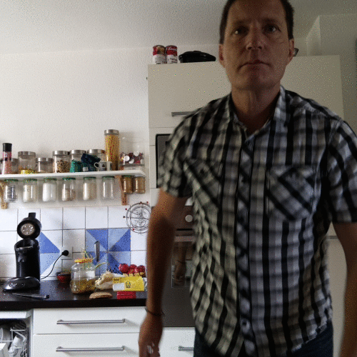
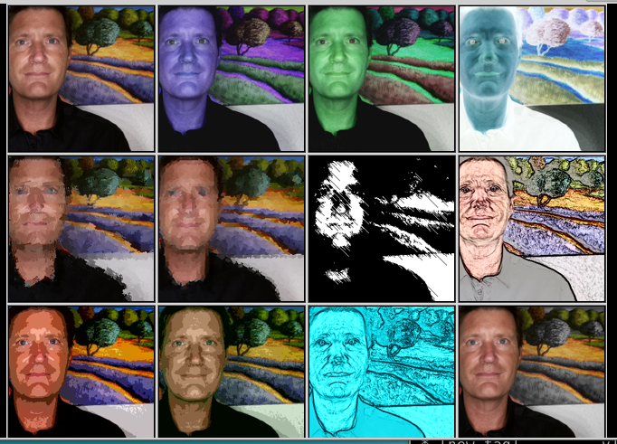

# Khichik

For hardware construction, see [Make Magazine article](https://makezine.com/projects/raspberry-pi-photo-booth/)

## Take a shortcut:
- [Installation](#install)
- [What's new?](#changes)
- [A note on confidentiality and security](#confidentiality)

## <a id="install"></a>Installing (extracted and adapted from [Make Magazine](https://makezine.com/projects/raspberry-pi-photo-booth/))


### Get the necessary packages

```
# update system
sudo apt-get update

# Install ImageTk, Image from PIL
sudo apt-get install python-imaging
sudo apt-get install python-imaging-tk

# Install google data api and upgrade it
sudo apt-get install python-gdata
sudo pip install --upgrade google-api-python-client
sudo pip install --upgrade oauth2client

# Install ImageMagick for the 'Animation' mode
sudo apt-get install imagemagick

# Install CUPS for the Printing function(optional)
sudo apt-get install cups
sudo apt-get install python-cups

# Setting up  CUPS/printer(optional)
https://www.techradar.com/how-to/computing/how-to-turn-the-raspberry-pi-into-a-wireless-printer-server-1312717
Test device:
Canon Selphy CP1300 with the Canon SELPHY CP900 - CUPS+Gutenprint v5.2.11  driver over USB

```

If google chrome is not on your system, the following might be necessary:

```
sudo apt-get install luakit
sudo update-alternatives --config x-www-browser
```
### Optional: create a Google project and enable the APIs
This is only needed if you plan to use the 'send email' or 'upload images to cloud' features of TouchSelfie.
[Here's an article](https://github.com/laurentalacoque/TouchSelfie-extended/wiki/CreateGoogleProject) that will help you creating a project and downloading its credentials

### Configure the program

1. run `setup.sh` script, this will:
  - guide you through the feature selection (email feature, upload feature)
  - Google Photos album selection
  - and will create a `photobooth.sh` launcher

2. `setup.sh` creates a configuration file `scripts/configuration.json`, you can edit this file to change configuration parameters, such as:
  - the logo file to put on your pictures
  - email subject and body
  - wether or not to archive snapshots locally
  - where to store pictures locally

3. Optionally you can change lower-level configuration options in the file `scripts/constants.py` such as:
  - captured image sizes
  - hardware dependent things


## <a id="changes"></a>Changes from [wyolum/TouchSelfie](https://github.com/wyolum/TouchSelfie)

### Zero password
- Now integrally based on OAuth2, neither the send-email, nor the upload-pictures will ask for and store a password. You will need to [create a Google project](https://github.com/laurentalacoque/TouchSelfie-extended/wiki/CreateGoogleProject) if you plan to use these features

### Send mails even from protected networks
- Many faculty/company networks block the sendmail port. By using OAuth2 authentication, photobooth emails are seen as https connection and are not blocked by the network anymore. (Again, [create a Google project](https://github.com/laurentalacoque/TouchSelfie-extended/wiki/CreateGoogleProject) for this)

### Easier setup
- a new `setup.sh` assistant will guide you through the configuration of the features you need (send_email, auto-upload) and will help you install the Google credentials.

### Hardware buttons support
- Added GPIO hardware interface for three buttons (with connections in hardware/ directory). Each button triggers a different effect. Software buttons are added if GPIO is not available. See `scripts/constants.py` to enable hardware buttons.

### Print selfies immediately
- A new 'print' button allows you to print selfies on a preconfigured printer (courtesy [Pikokosan](https://github.com/Pikokosan))

### New effects
- Added "Animation" effect that produces animated gifs (needs imagemagick)



- Choose among `PiCamera` builtin image effects for more creative snapshots



### Higher resolution pictures
- supports new v2.1 pi camera
- Supports arbitrary resolution for snapshots (configure it in constants.py)

### Better snap preview mode

- Preview now uses images for countdown: be creative! see `constants.py` for customizations.
- Preview is now horizontally flipped which is consistent with cameraphone behaviors and your bathroom mirror. (Previous mode was confusing for users)

### User interface improvements

- Modern "black" userinterface with icon buttons


- New skinnable Touchscreen keyboard "mykb.py"


- Removed configuration button to avoid pranks
  - use `setup.sh` to setup credentials and setup Google Photo Album
  - tune configuration in `constants.py`
  - limited runtime configuration (exit, enable/disable email and upload) is still possible via long press)

- snapshot display now supports animated gifs

- Mail address logging available in configuration
  - photobooth users can opt-out from the mail logging if activated

- command line arguments to enable/disable some features:
  - enable/disable fullscreen startup
  - enable/disable email sending
  - enable/disable auto-upload
  - enable/disable hardware buttons support (on-screen buttons displayed instead)
  - *Use `python user_interface.py --help` for a description of command line options*
